## Normalitásvizsgálat

* Grafikus módszerek
* Ferdeség és csúcsosság alapján
* Illeszkedésvizsgálat alapján
 * Kolmogorov-Szmirnov-próba
 * Shapiro-Wilk-próba
 * Jarque-Bera-próba
 * Pearson-féle khi-négyzet próba
 * ...


--- .class #id 

## Grafikus illeszkedésvizsgálat

* hisztogram (`hist()`), 
* gyakorisági görbe, 
* simított hisztogram (`plot(density()), rug()`), 
* szár-levél diagram, 
* QQ-ábra (quantile-quantile plot) (`qqplot()`, `qqnorm()`, `qqline()`)


---
## Példa 

161 db patika havi forgalmának az adata (ezer Ft-ban) található a `havi_forgalom.txt`-ben. Vizsgáljuk meg a normalitási feltételt!


```r
hf <- read.table(file = "data/havi_forgalom.txt", header = T, dec = ".")
str(hf)
```

```
## 'data.frame':	161 obs. of  1 variable:
##  $ havi.forgalom: int  9000 4600 20000 20000 16000 6500 5800 8000 4400 13000 ...
```

```r
head(hf, n = 4)
```

```
##   havi.forgalom
## 1          9000
## 2          4600
## 3         20000
## 4         20000
```


---
## Hisztrogram rajzolása


```r
hs.hist <- hist(hf$havi.forgalom, breaks = 15, col = "gray")
```

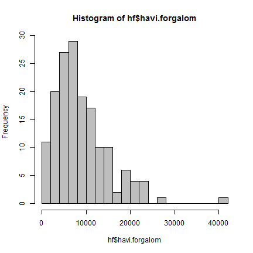 


---
## Gyakorisági görbe rajzolása


```r
plot(c(min(hs.hist$breaks), hs.hist$mids, max(hs.hist$breaks)), c(0, hs.hist$counts, 
    0), type = "o", lwd = 3)
```

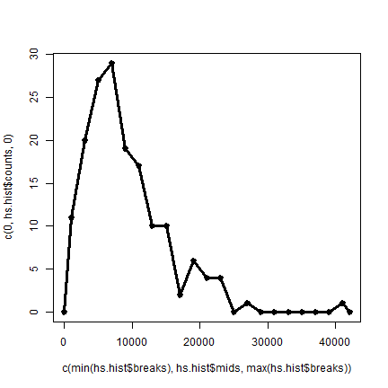 


---
## Hisztogram vizuális összevetése a normális eloszlás görbéjével


```r
hist(hf$havi.forgalom, freq = F, breaks = 15, col = "gray")
curve(dnorm(x, mean = mean(hf$havi.forgalom), sd = sd(hf$havi.forgalom)), add = T, 
    col = "blue", lwd = 3)
```

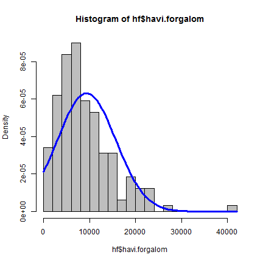 


---
## Simított hisztogram

```r
plot(density(hf$havi.forgalom), xlab = "", lwd = 3)
rug(hf$havi.forgalom)
```

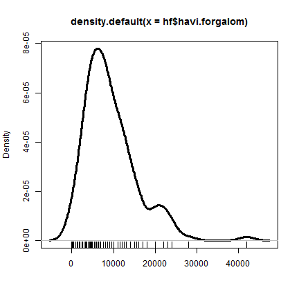 


---
## Simított hisztogram és összevetése a normális eloszlás görbéjével

```r
plot(density(hf$havi.forgalom), xlab="", lwd=3);rug(hf$havi.forgalom)
curve(dnorm(x, mean=mean(hf$havi.forgalom), sd=sd(hf$havi.forgalom)), 
      add=T, col="blue", lwd=3)
```

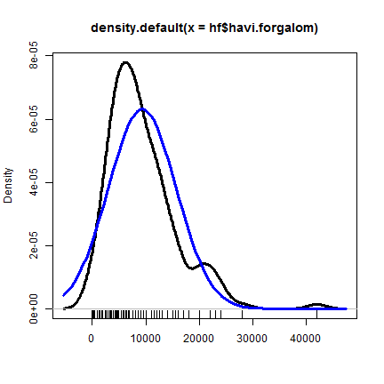 


--- .smalloutput
## Szár-levél diagram

```r
stem(hf$havi.forgalom)
```

```
## 
##   The decimal point is 3 digit(s) to the right of the |
## 
##    0 | 0013503588
##    2 | 0560002223569
##    4 | 000000003455555667000005588
##    6 | 000000002355800000000055
##    8 | 000000000000055500000005
##   10 | 000000000000005
##   12 | 00000000005500000
##   14 | 000000006
##   16 | 00000
##   18 | 0
##   20 | 000000
##   22 | 00000
##   24 | 000
##   26 | 
##   28 | 0
##   30 | 
##   32 | 
##   34 | 
##   36 | 
##   38 | 
##   40 | 
##   42 | 0
## 
```


---
## Szár-levél diagram

Félgrafikai ábrázolás, amelyből az osztályozás ellenére 
az eredeti adatokról is kapunk információt, és ezen
kívül a gyakorisági eloszlásról is benyomást szerzünk.

Egy adat értelmezése: 
szár| egy levél = az adat egész része a szár, 
                                a tört része a tekintett levél
Pl.: $2 | 0 = 2.0$ vagy $2 | 5 = 2.5$
Vegyük figyelembe, hogy a szár egy-egy osztályt képvisel!

Az outputból kiolvasható, hogy a tizedesvesszőt 
3 jeggyel jobbra kell vinni, azaz szoroznunk kell ezerrel.
Így a tényleges adatok:

Pl.: $2 | 0 = 2.0*1000= 2000$ vagy $2 | 5 = 2.5*1000=2500$


---
## QQ-ábra (quantile-quantile plot)
* Az ábra segítségével szemrevételezéssel eldönthetjük, hogy az $n$ elemű minta származhat-e egy hipotetikus eloszlásból.

* A módszer alapja, hogy a rendezett minta $i$-edik értéke várhatóan a hipotetikus eloszlás $i/n$ kvantilese közelében lesz.

* A QQ-ábra $n$ elemű (rendezett) minta esetében $n$ db pontot tartalmaz, melyek ($x_i$, $y_i$) koordinátái:

* $x_i$ a hipotetikus eloszlás  $i/n$ kvantilese, $y_i$ a rendezett minta $i$-edik értéke (ami egyben a tapasztalati eloszlás  $i/n$ kvantilese.


--- &twocol_1 .smallinputoutput
## A QQ-ábra mögött

*** left


```r
# A hipotetikus eloszlás kvantilisei
elmeleti.q <- qnorm(1:length(hf$havi.forgalom)/
  length(hf$havi.forgalom),
  mean=mean(hf$havi.forgalom),
  sd=sd(hf$havi.forgalom))

# a tapasztalati kvantilisek (a rendezett minta)
tapasztalati.q <- sort(hf$havi.forgalom)

# pontok megjelenítése: QQ-ábra
par(mar=c(2,2,2,2))
plot(elmeleti.q, tapasztalati.q)
```

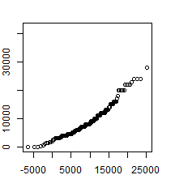 


*** right

```r
## QQ-ábra az R-ben
qqnorm(hf$havi.forgalom)
qqline(hf$havi.forgalom)  # egyenes rajzolása
```

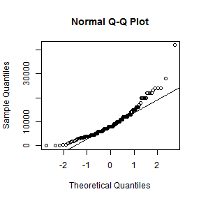 


---
## QQ-ábra (quantile-quantile plot)

* Ha a hipotetikus eloszlásfüggvény jól illeszkedik a mintához, akkor a pontok az $y=x$ egyenes közelében helyezkednek el. A pontok egyeneshez való illeszkedése szemrevételezéssel elég jól eldönthető.  Az eltérések akkor tekinthetők véletlennek, ha nincs bennük szabályosság, tendencia.
* Az R-beli `qqnorm()` függvény a standard normális eloszlást tekinti hipotetikus függvénynek, így az egyenes nem feltétlenül az $y=x$.
* Az R-beli `qqplot()` függvénnyel tetszőleges hipotetikus eloszlást választhatunk (pl. t-eloszlást, F-eloszlást stb.).


---
## 161 patika havi forgalma


```r
par(mfrow = c(1, 2))
hist(hf$havi.forgalom, col = "gray", main = "Havi forgalom")
qqnorm(hf$havi.forgalom, main = "Jobbra ferde eloszlas QQ-abraja")
qqline(hf$havi.forgalom)
```

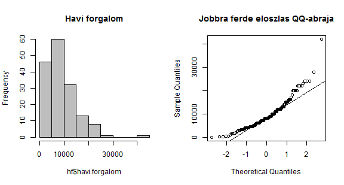 


---
## 31022 vizsgázó adata

```r
data(Chem97, package = "mlmRev")
par(mfrow = c(1, 2))
hist(Chem97$gcsescore, col = "gray", main = "Vizsgapontszamok")
qqnorm(Chem97$gcsescore, main = "Balra ferde eloszlas QQ-abraja")
qqline(Chem97$gcsescore)
```

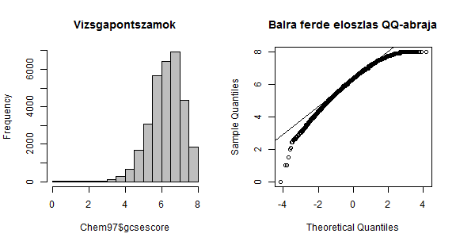 


---
## 272 kitörési adat az Old Faithful gejzírről

```r
par(mfrow = c(1, 2))
hist(faithful$eruptions, col = "gray", main = "Kitoresek idotartama (perc)")
qqnorm(faithful$eruptions, main = "Bimodalis eloszlas QQ-abraja")
qqline(faithful$eruptions)
```

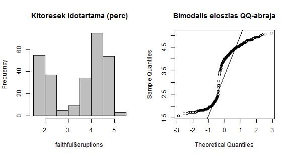 


---
## Ferdeségi és csúcsossági együtthatók
Ferdeségi együttható (${\gamma _1}$): az eloszlás horizontális alakját leíró mutatószám. Pozitív érték esetén az eloszlás jobbra ferde, míg negatív érték esetében balra ferde. A felvehető értékeknek nincs felső vagy alsó határa.
Normális eloszlású változó ferdeségi együtthatója nulla.
Kiszámítása a mintából:

$${\gamma _1} = \frac{{{m_3}}}{{{s^3}}},\;{m_3} = \frac{{\sum\limits_{i = 1}^n {{{({x_i} - \overline x )}^3}} }}{n}$$

---
## Ferdeségi és csúcsossági együtthatók
Csúcsossági együttható (${\gamma_2}$): az eloszlás alakját vertikálisan leíró mutatószám. 
Normális eloszlású változó csúcsossági együtthatója nulla.
Pozitív érték esetén az eloszlás ehhez képest csúcsosabb, míg negatív érték esetében laposabb. A felvehető értékeknek nincs felső vagy alsó határa.
Kiszámítása a mintából:

$${\gamma _2} = \frac{{{m_4}}}{{{s^4}}},\;{m_4} = \frac{{\sum\limits_{i = 1}^n {{{({x_i} - \overline x )}^4}} }}{n}$$


---
## Ferdeségi és csúcsossági együtthatók az R-ben


```r
# ferdeség és csúcsosság
library(psych)
skew(hf$havi.forgalom)
```

```
## [1] 1.468
```

```r
kurtosi(hf$havi.forgalom)
```

```
## [1] 3.724
```


Ha a ferdeségi és/vagy a csúcsossági mutatók értéke meghaladja a +1 vagy a -1 értéket, akkor az azt jelenti, hogy az adott eloszlás különbözik a normális eloszlástól.

---
## Hipotézisvizsgálat az alakmutatókra

Ha a ferdeség és a csúcsosság értékét osztjuk azok standard hibájával, akkor hipotézisvizsgálatot is végrehajthatunk ($H_0: {\gamma_1}=0$ és $H_0: {\gamma _2}=0$).


```r
# hip.vizsgálat a ferdeségre és csúcsosságra, p-értékek
# meghatározása
u <- skew(hf$havi.forgalom)/sqrt(6/length(hf$havi.forgalom))
2 * (1 - pnorm(u))
```

```
## [1] 2.82e-14
```

```r
u <- kurtosi(hf$havi.forgalom)/sqrt(24/length(hf$havi.forgalom))
2 * (1 - pnorm(u))
```

```
## [1] 0
```


---
## Illeszkedésvizsgálat

Hipotézisvizsgálat (család), amely során egy ismeretlen eloszlást – amelyikből a mintát vettük- hasonlítunk össze egy hipotetikus eloszlással. 

$H_0$: Az ismeretlen eloszlás, amelyből a minta származik, a hipotetikus eloszlással azonos (vagy abba az eloszláscsaládba tartozik).

$H_1$: Az ismeretlen eloszlás különbözik a hipotetikus  eloszlástól (illetve nem abba a családba tartozik).


---
## Kolmogorov-Szmirnov-próba

A normalitás vizsgálatára egymintás Kolmogorov-Szmirnov próbát használjuk, amely azt vizsgálja, hogy a minta vajon adott (pl. normális,  Poisson, egyenletes, exponenciális, stb.) eloszlású-e? 
$H_0$: A populáció adott (esetünkben normális) eloszlású

A próba lényege, hogy az elméleti és az empirikus eloszlásfüggvény közötti maximális eltérést hasonlítunk össze a táblázatbeli kritikus értékkel. (Ez a minta elemszámától és a szignifikancia szinttől függ.) 


---
## Kolmogorov-Szmirnov-próba
$D$-vel jelöljük a lehető legnagyobb eltérést az empirikus és az elméleti eloszlásfüggvény között. Ezt az értéket hasonlítjuk a össze a Kolmogorov-Szmirnov táblázat kritikus $Dkrit({\alpha} ,n)$ értékével: 
ha $D < Dkrit$, akkor elfogadjuk $H_0$-t, az elméleti és az empirikus eloszlás közötti eltérés nem szignifikáns. 
ha ha $D > Dkrit$ , akkor elvetjük $H_0$-t, az elméleti és az empirikus eloszlás közötti eltérés szignifikáns 


--- .smallinputoutput
## Kolmogorov-Szmirnov-próba

```r
# elméleti eloszlásfüggvény
f.r <- sort(hf$havi.forgalom); n <- length(f.r)
curve(pnorm(x, mean=mean(f.r), sd=sd(f.r)),xlim=range(f.r), xlab="havi forgalom ertekei", ylab="kumulativ relativ gyakorisag")
points(f.r, pnorm(f.r, mean=mean(f.r), sd=sd(f.r)))
# tapasztalati eloszlásfüggvény
f.r.t <- table(f.r); points(names(f.r.t), cumsum(f.r.t/sum(f.r.t)), pch=15, type="p")
points(names(f.r.t), cumsum(f.r.t/sum(f.r.t)), pch=15, type="s")
legend("bottomright", pch=c(15,1), legend=c("mert ertek", "varhato (elmeleti) ertek"))
```

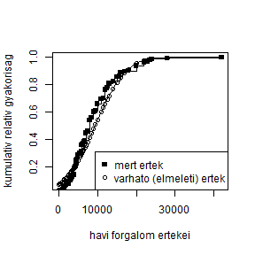 


---
## Kolmogorov-Szmirnov-próba

```r
# az előző parancsok folytatásaként
D <- max(abs(pnorm(f.r, mean = mean(f.r), sd = sd(f.r)) - 1:n/n))
```


$$Z = \sqrt n  \cdot D = \sqrt n  \cdot \max \left| {{F_{tap}} - {F_{elm}}} \right|$$

A Kolmogorov-Smirnov Z-érték a megfigyelt és teoretikus kumulált eloszlás függvények közötti legnagyobb abszolút különbségből számítják. 
Ezt az értéket szorozzák a megfigyelések négyzetgyökével. A Z-érték alapján számolható ki a p-érték, az ún. Kolmogorov eloszlás alapján.
A Kolmogorov-Smirnov teszt módosítása a Lilliefors-próba, amely Lilliefors eloszlást használ a nullhipotézis tesztelésére.


---
## Kolmogorov-Szmirnov-próba az R-ben


```r
# az eredeti K-S-próba
ks.test(hf$havi.forgalom, "pnorm", mean = mean(hf$havi.forgalom), sd = sd(hf$havi.forgalom))
```

```
## Warning: ties should not be present for the Kolmogorov-Smirnov test
```

```
## 
## 	One-sample Kolmogorov-Smirnov test
## 
## data:  hf$havi.forgalom 
## D = 0.1249, p-value = 0.01315
## alternative hypothesis: two-sided 
## 
```


---
## A Kolmogorov-Szmirnov-próba Lilliefors változata

```r
# Lilliefors változat
library(nortest)
lillie.test(hf$havi.forgalom)
```

```
## 
## 	Lilliefors (Kolmogorov-Smirnov) normality test
## 
## data:  hf$havi.forgalom 
## D = 0.1249, p-value = 1.939e-06
## 
```


---
## Shapiro-Wilk-próba

$H_0$: Az adott változó normál eloszlást követ

$H_1$: Az adott változó NEM normál eloszlást követ

* A legmegbízhatóbb eljárás a normalitás hiányának detektálására kis és közepes méretű minta esetében .
* Csak azt állapítja meg, hogy egy változó nem normális eloszlást követ, de nem garantálja a normalitást.
* A teszt során kiszámolt W próbastatisztika értéke maximum 1 lehet. 
* Ennél kisebb érték esetén nem normális az eloszlás. 


---
## Shapiro-Wilk-próba az R-ben

```r
shapiro.test(hf$havi.forgalom)
```

```
## 
## 	Shapiro-Wilk normality test
## 
## data:  hf$havi.forgalom 
## W = 0.8983, p-value = 4.196e-09
## 
```


---
## 8. Házi feladat

13 legfeljebb 8 általánost végzett, 28-45 éves nő Rorschach-tesztbeli feleletszáma (fsz) a következő: 8, 10, 11, 11, 13, 17, 18, 20, 22, 23, 28, 35, 41.

Állapítsuk meg (az összes szóba jöhető módszer közül legalább 3-mal) ezen minta alapján, hogy az adott iskolázottságú és életkorú nők populációjában normálist eloszlást követ-e a Rorschach-fsz változó!


